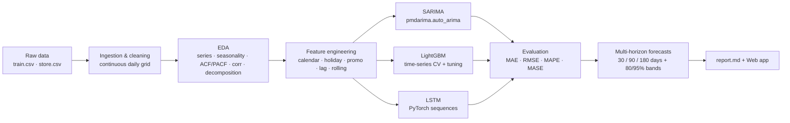
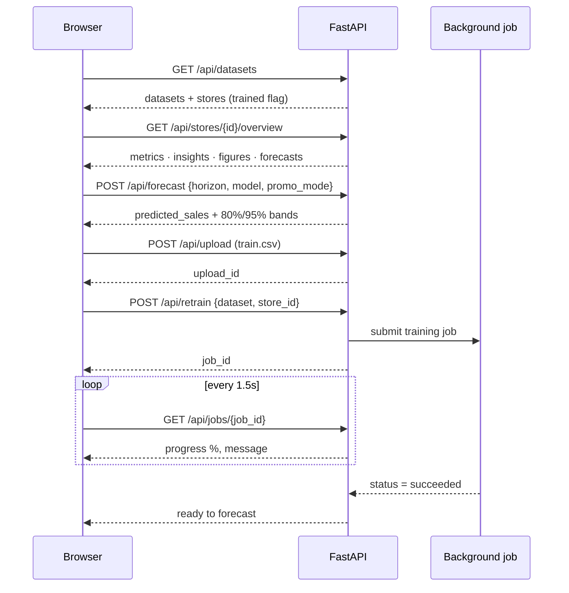
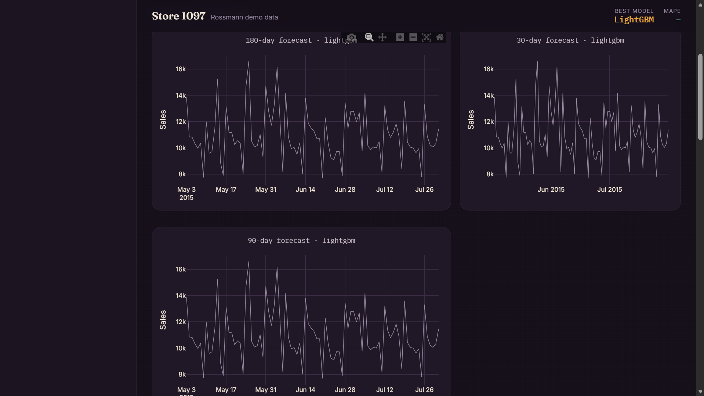
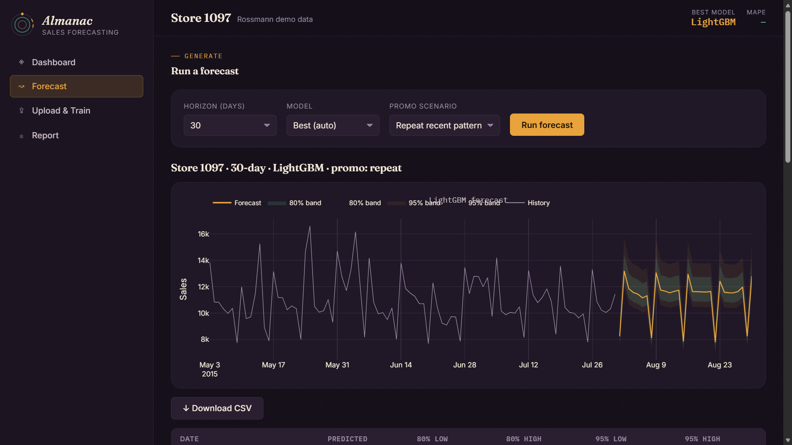
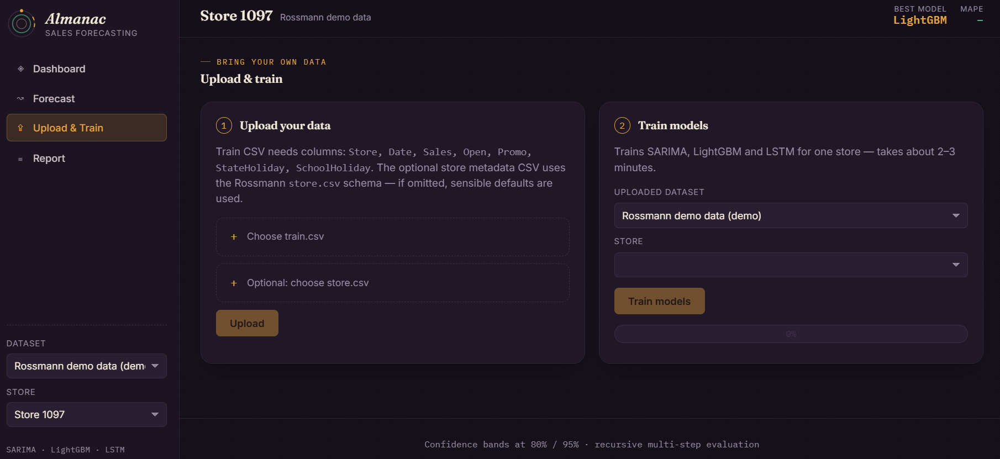

<div align="center">

# 📈 Sales Forecasting — Time-Series Analysis

**Rossmann Store Sales · SARIMA · LightGBM · LSTM**

End-to-end, reproducible forecasting of **daily store sales**, delivered as a Python
pipeline **and** an interactive web application.

</div>

<div align="center">


</div>

---

## ✨ Highlights

- 🧠 **Three model families** — classical (SARIMA), machine learning (LightGBM) and deep learning (LSTM) — compared under one evaluation protocol
- 🎯 **Multi-horizon forecasts** — 30 / 90 / 180 days ahead with **80% / 95% confidence bands**
- 🌐 **Interactive web app** — dashboard, on-demand forecasting, custom CSV upload and background retraining with live progress
- 🔄 **Recursive multi-step evaluation** — not just one-step-ahead, so results reflect real forecasting use
- 📊 **Rich EDA & diagnostics** — seasonality, ACF/PACF, correlation, decomposition, feature importance
- 📝 **Auto-generated Markdown report** with business insights and recommendations
- 🐳 **Dockerized** — one command to deploy locally or in the cloud

---

## 🧩 How it works



<details>
<summary><strong>▸ Web app request flow</strong> (click to expand)</summary>

How the browser, FastAPI backend and background job runner talk to each other for the three core actions — loading a dashboard, running a forecast, and training on uploaded data:



</details>

---

## 🖼️ Screenshots

### Web application

<!--
  Drop PNG/JPG screenshots into a `docs/screenshots/` folder (create it if it
  doesn't exist yet) and update the paths below — GitHub will render them
  inline once the files exist. Recommended shots:
    docs/screenshots/dashboard_1.png    – Dashboard tab, store overview + KPIs
    docs/screenshots/forecast.png     – Forecast tab, chart with 80/95% bands
    docs/screenshots/upload.png       – Upload & Train tab, progress bar mid-run
-->

| Dashboard | Forecast |
|:---:|:---:|
|  |  |
| Store overview — KPI strip, model comparison, feature importance, EDA gallery | On-demand forecast with 80%/95% confidence bands, CSV download |

| Upload & Train |
|:---:|
|  |
| Drop in your own CSV, then train SARIMA / LightGBM / LSTM with live progress |

> No screenshots yet? Run `python run_web.py`, open `http://127.0.0.1:8000`, and
> capture each tab — then save them at the paths above and this section lights up
> automatically. Until then, GitHub shows the alt text as a placeholder.

### Pipeline output figures

| Time series & trends | Forecast with confidence bands |
|:---:|:---:|
|  |  |

| Seasonality analysis | Feature importance |
|:---:|:---:|
|  |  |

---

## 🚀 Quickstart

### 1. Local (Python)

```bash
pip install -r requirements.txt
```

### 2. Run the full pipeline + report

```bash
# all stores in the config (1097, 682, 733)
python run_pipeline.py

# custom stores / horizons / split
python run_pipeline.py --stores 1 4 85 --horizons 30 90 --split 0.8
```

Outputs land in `outputs/` — figures, per-store/model forecast CSVs, trained artifacts and `report.md`.

### 3. Run the web app

```bash
python run_web.py          # → http://127.0.0.1:8000
```

### 4. Run with Docker

```bash
docker build -t sales-forecast .
docker run --rm -p 8000:8000 sales-forecast
# open http://localhost:8000
```

The image uses a CPU-only PyTorch build to stay lean.

---

## 🌐 Web application

A FastAPI backend + single-page frontend (no build step, offline Plotly) exposes the whole workflow in the browser. Pick a dataset and store once from the sidebar — that context follows you across every tab.

| Tab | What it does |
|---|---|
| **Dashboard** | Store overview at a glance — KPI strip (best model, MAPE, promo lift, holiday delta), model comparison table, feature importance, error-by-segment breakdown, precomputed forecast charts, and a click-to-zoom EDA figure gallery |
| **Forecast** | On-demand forecast for the selected store — pick horizon, model and promo scenario, get 80%/95% confidence bands charted instantly, CSV downloadable |
| **Upload & Train** | Upload your own `train.csv` (+ optional `store.csv`), train all three models for one store (~2–3 min) with a live progress bar, then it's ready to forecast |

### REST API

Interactive docs at [`/docs`](http://127.0.0.1:8000/docs).

| Method | Endpoint | Description |
|---|---|---|
| GET | `/api/health` | Health check |
| GET | `/api/datasets` | List datasets and their stores |
| GET | `/api/stores/{id}/overview?dataset=demo` | Summary, metrics, figures, forecasts |
| GET | `/api/stores/{id}/history?dataset=demo&days=120` | Historical sales for charts |
| POST | `/api/forecast` | `{dataset, store_id, horizon, model, promo_mode}` → forecast + bands |
| POST | `/api/retrain` | `{dataset, store_id}` → starts background training → `{job_id}` |
| GET | `/api/jobs/{job_id}` | Poll training progress |
| POST | `/api/upload` | Multipart `train_file` (+ `store_file`) → `{upload_id}` |

`dataset` is `demo` (bundled Rossmann data) or `upload:<upload_id>`. Uploaded datasets live under `webapp_data/uploads/`.

---

## 🤖 Models

| Family | Model | Notes |
|---|---|---|
| Classical | **SARIMA** (`pmdarima.auto_arima`, seasonal period 7) | Baseline with native prediction intervals |
| Machine Learning | **LightGBM** on lag/rolling/calendar features | Time-series CV + grid search tuning |
| Deep Learning | **LSTM** (PyTorch, sequence windows) | Recursive multi-step forecasting |

### Evaluation protocol

- Strict **chronological split**: first 80% train, last 20% test
- Metrics: **MAE, RMSE, MAPE, MASE** (MASE vs seasonal-naive at lag 7)
- Both **one-step-ahead** and **recursive multi-step** evaluation
- Error segmentation by **promotion status, weekday and holiday**

### Results (recursive test period)

| Store | Best model | MAE | RMSE | MAPE | MASE |
|---|---|---|---|---|---|
| 1097 (low volume) | LightGBM | 786 | 1,045 | **7.09%** | 0.62 |
| 682 (mid volume) | LightGBM | 940 | 1,372 | **7.91%** | 0.33 |
| 733 (high volume) | LightGBM | 1,337 | 1,755 | **8.24%** | 0.73 |

> 💡 The LSTM is very strong **one-step-ahead** (MAPE ≈ 1%) but compounds error over
> long recursive horizons. **LightGBM** with explicit lag/rolling features is the most
> robust multi-step model. See `outputs/report.md` for the full comparison, EDA insights,
> promotion-impact scenarios and business recommendations.

---

## 📂 Project structure

```
sales_forecasting/
├── data/                      # raw train.csv + store.csv
├── src/sales_forecast/
│   ├── config.py              # central configuration
│   ├── holidays.py            # German holiday calendar
│   ├── ingestion.py           # load, clean, reindex (no missing timestamps)
│   ├── features.py            # cyclical, holiday, promo, lag, rolling features
│   ├── eda.py                 # figures: series, seasonality, ACF/PACF, corr, decomposition
│   ├── evaluate.py            # MAE, RMSE, MAPE, MASE + error segmentation
│   ├── forecast.py            # recursive multi-step forecast + confidence bands
│   ├── report.py              # report.md generation
│   ├── models/                # SARIMA, LightGBM, LSTM
│   └── pipeline.py            # run_store / run_pipeline / forecast_sales
├── webapp/                    # FastAPI + single-page frontend
│   ├── main.py, api.py, service.py, jobs.py, schemas.py, config.py
│   └── static/                # index.html, app.js, style.css, vendor/plotly.min.js
├── notebook/
│   ├── sales_forecasting.ipynb   # interactive walkthrough
│   └── generate_notebook.py      # regenerates the notebook
├── docs/
│   └── screenshots/           # dashboard.png, forecast.png, upload.png (add your own)
├── outputs/                   # figures/, forecasts/, models/, report.md (generated)
├── run_pipeline.py            # CLI entry point
├── run_web.py                 # web app entry point
├── Dockerfile
├── requirements.txt
└── pyproject.toml
```

---

## 📤 Bring your own data

Upload a CSV with these columns (in any order / case):

```csv
Store,Date,Sales,Open,Promo,StateHoliday,SchoolHoliday
```

- Optionally provide a Rossmann-style `store.csv` for metadata (assortment, competition, Promo2). If omitted, sensible defaults are used.
- Works with **any number of stores** and **any date range**; missing timestamps are handled automatically.
- Train one store at a time in the browser (~2–3 min) — or run the whole thing offline with `run_pipeline.py`.

---

## 🔧 Customization

`src/sales_forecast/config.py` centralises everything:

```python
stores=(1097, 682, 733)   # stores to process
split_ratio=0.8            # chronological train/test split
horizons=(30, 90, 180)     # forecast horizons (days)
quantiles=(0.025, 0.10, 0.90, 0.975)
```

Programmatic interface:

```python
from sales_forecast.pipeline import forecast_sales

fc = forecast_sales(1097, horizon=30)
# returns date, predicted_sales, lower_80, upper_80, lower_95, upper_95
```

---

## 🛠️ Tech stack

Python 3.10+ · pandas · NumPy · scikit-learn · statsmodels · **pmdarima** · **LightGBM** · **PyTorch** · Matplotlib · **FastAPI** · Uvicorn · JavaScript/Plotly · Docker · Jupyter

## ⚖️ License

Released under the MIT License — free to use, modify and distribute. (Add your preferred `LICENSE` file before publishing.)

## 👏 Acknowledgements

- [Rossmann Store Sales](https://www.kaggle.com/c/rossmann-store-sales) dataset (Kaggle competition)
- `pmdarima` for `auto_arima` · `LightGBM` · PyTorch community
